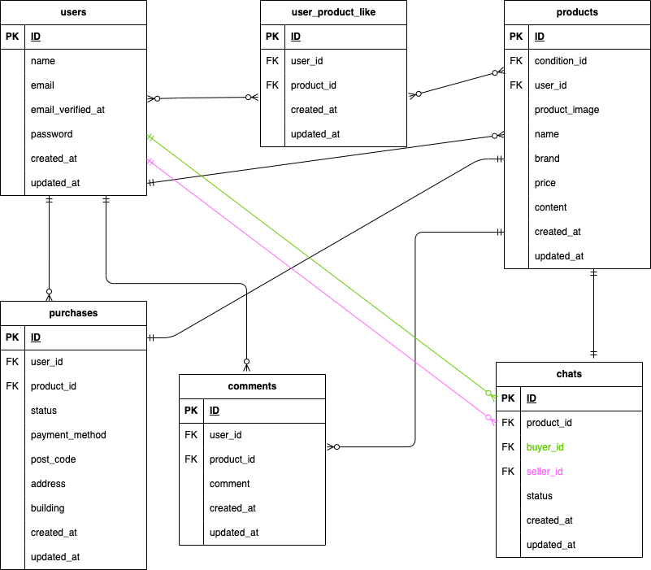

# 模擬案件１　フリマアプリ

## 環境構築

### Docker ビルド

1. リポジトリをクローン

   `git clone git@github.com:O-Yukine/Mock-Projrct-FleaMarketApp.git`

2. Docker アプリを立ち上げる

3. Docker ビルド

   `docker-compose up -d --build`

### Laravel 環境構築

1. PHP コンテナに入る

   `docker-compose exec php bash`

2. Composer パッケージをインストール

   `composer install`

3. 環境設定ファイルをコピー

   `cp .env.example .env`

4. .env ファイルを編集

   DB_HOST=mysql
   DB_DATABASE=laravel_db  
   DB_USERNAME=laravel_user  
   DB_PASSWORD=laravel_pass

5. アプリケーションキーの作成

   `php artisan key:generate`

6. マイグレーションの実行

   `php artisan migrate`

7. シーディングの実行

   `php artisan db:seed`

### ユーザー登録時のメール認証システムの導入

\*以下 mailtrap を利用しています

1. mailtrap のアカウントを作成

2. mailtrap より SMTP を取得して、以下の情報を.env ファイルに追加

   MAIL_MAILER=  
   MAIL_HOST=  
   MAIL_PORT=
   MAIL_USERNAME=  
   MAIL_PASSWORD=
   MAIL_ENCRYPTION=  
   MAIL_FROM_ADDRESS=任意のメールアドレス  
   MAIL_FROM_NAME="${APP_NAME}"

3. ユーザー登録時に mailtrap にメールが送られてくるので、そのメールよりメール認証を完了させてください

### stripe 決済システムの導入

1. Stripe アカウントの作成

2. API キーを取得して .env に設定

   Stripe ダッシュボード →「開発者」→「API キー」より取得し、.env に追加

   STRIPE_KEY=pk_test_xxxxx
   STRIPE_SECRET=sk_test_xxxxx

3. コンビニ決済を有効化

   Stripe ダッシュボード →「支払い方法」より **コンビニ決済** を ON にする

4. Stripe CLI の設定（Webhook テスト用）

   Stripe CLI をインストール（macOS)

   `brew install stripe`

   Windows / Linux は公式サイト参照

5. Stripe にログイン

   `stripe login`

6. Webhook イベントを Laravel に転送

   `stripe listen --forward-to http://localhost/stripe/webhook`

7. 表示される Webhook Secret を .env に追加：

   STRIPE_WEBHOOK_SECRET=whsec_xxxxx

8. テスト用カード・コンビニ決済情報

### カード払い

- カード番号:4242 4242 4242 4242
- 有効期限: 未来の日付
- CVV: 任意の 3 桁の番号
- 名義: 任意のもの(架空のもので可)

### コンビニ決済

- コンビニ払いを確定すると支払いコードが発行される

9. Webhook 受信

   Stripe CLI を実行中の状態で、Stripe からの決済完了イベント  
   （例：`payment_intent.succeeded`）を `/stripe/webhook` で受信します。

## ユニットテストとテスト環境構築

1.  テスト用のデータベースを作る

    MySQL のコンテナ内に入る（パスワードは docker-compose.yml に設定されているものを使用)

    `docker-compose exec mysql bash`  
     `mysql -u root -p`

    laravel_test を作成

    `CREATE DATABASE laravel_test;`

2.  config ファイルの変更

    config ディレクトリ内の database.php を開き、mysql の配列部分をコピーして新たに mysql_test を作成

         'mysql_test' => [
             'driver' => 'mysql',
             'url' => env('DATABASE_URL'),
             'host' => env('DB_HOST', '127.0.0.1'),
             'port' => env('DB_PORT', '3306'),
             'database' => 'laravel_test',
             'username' => 'root',
             'password' => 'root',
             'unix_socket' => env('DB_SOCKET', ''),
             'charset' => 'utf8mb4',
             'collation' => 'utf8mb4_unicode_ci',
             'prefix' => '',
             'prefix_indexes' => true,
             'strict' => true,
             'engine' => null,
             'options' => extension_loaded('pdo_mysql') ? array_filter([
                 PDO::MYSQL_ATTR_SSL_CA => env('MYSQL_ATTR_SSL_CA'),
             ]) : [],
         ],

3.  テスト用.env を作る

    `cp .env .env.testing`

4.  .env.testing を編集

    APP_ENV=test  
    APP_KEY=

    DB_DATABASE=laravel_test  
    DB_USERNAME=root  
    DB_PASSWORD=root

5.  テスト用アプリケーションキーの作成

    `php artisan key:generate --env=testing`

6.  マイグレーションの実行

    `php artisan migrate --env=testing`

7.  テストの実行は以下のコマンド

    `php artisan test tests/Feature`
    または

    `vendor/bin/phpunit tests/Feature`

    もしくは

    `php artisan test tests/Feature/行いたいテストファイル`

    でファイルごとにテストを行えます

## 使用技術（実行環境）

- PHP8.1
- Laravel8.83.8
- MySQL8.0.26

## ER 図

## URL

- 開発環境: http://localhost/
- phpMyAdmin: http://localhost:8080/
